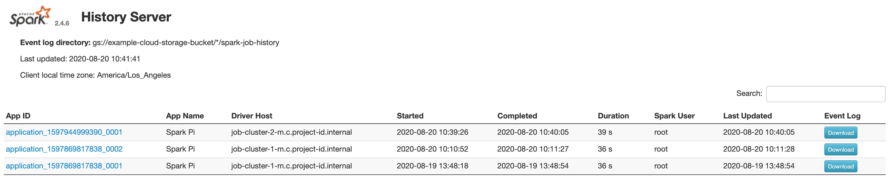

Spark 로그는 job의 상태를 분석할 때 아주 유용하게 사용됩니다. 보통의 경우 Spark가 설치된 클러스터에서 Spark UI를 통해 확인을 할 수 있지만 다수의 사용자가 사용하는 클러스터인 경우 혹은 생명 주기가 짧은 클러스터에서 실행된 Spark job의 로그를 추후에 분석하기 위해서 로그를 다운로드해 local에서 로그를 확인해야 하는 경우가 있습니다.

## Spark 로그 다운로드하기



Spark 로그를 다운로드하기 위해서는 클러스터의 Spark UI에서 `Event Log` 항목의 `Download`를 클릭하면 됩니다.

## 로컬에서 Spark History Server 실행

### Spark 설치

`MacOS`인 경우 아래와 같이 `Homebrew`를 사용해서 Spark를 설치하면 됩니다.
```
brew install apache-spark
```

혹시 `Homebrew`가 설치가 안 되어 있으면 다음 글을 참조하세요 👉 [Homebrew 설치하기](https://burn.eone.one/ko/posts/mac/old/2021-05-08-homebrew-install/)

### 로그 파일 저장

Spark 로그를 저장할 디렉토리를 만든 후 다운로드해 둔 로그 파일을 해당 디렉토리로 옮깁니다.

### log.properties

`log.properties` 파일을 생성하고 `log.properties` 파일에는 위에서 만든 로그 디렉토리 경로를 아래와 같이 입력합니다.
```
spark.history.fs.logDirectory=<path to the spark-logs directory>
```

### Spark History Server 실행

아래와 같이 spark history server를 실행합니다. parameter로 위에서 생성한 `log.properties` 파일 경로를 입력해 줍니다.
```
sh start-history-server.sh --properties-file <path to log.properties>
```

`start-history-server.sh` 파일이 PATH 지정이 안 되어 있는 경우에는 아래 위치로 이동하여 위 명력을 입력하면 됩니다.

> /usr/local/Cellar/apache-spark/<version>/libexec/sbin

spark history server를 실행했으면 브라우저에 [http://localhost:18080](http://localhost:18080)를 입력하면 Spark UI에 접속할 수 있습니다.
