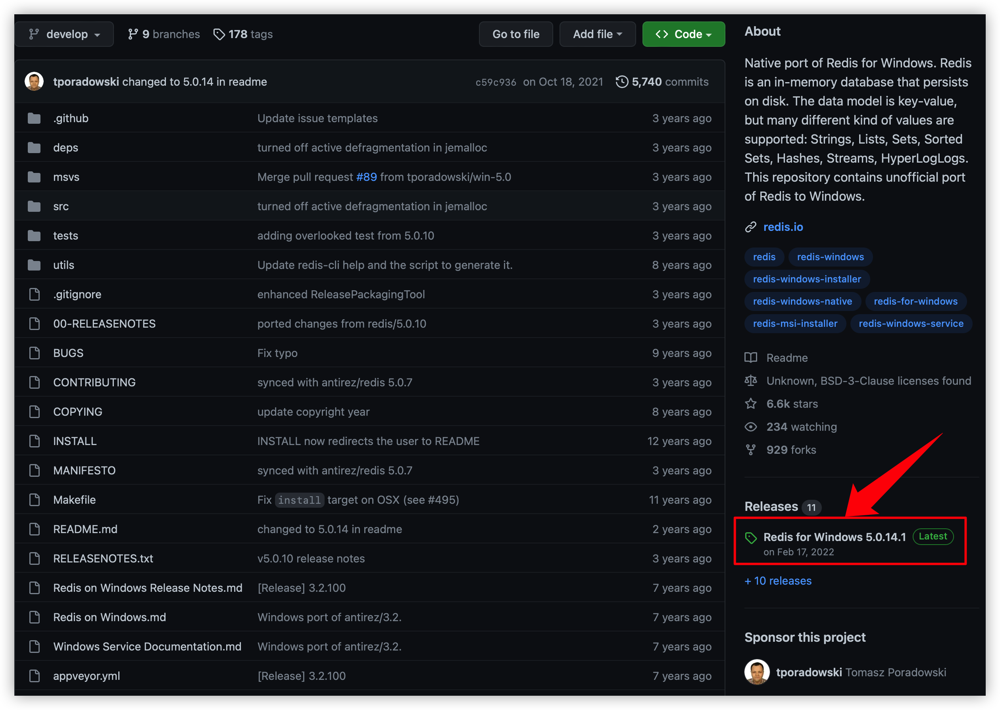
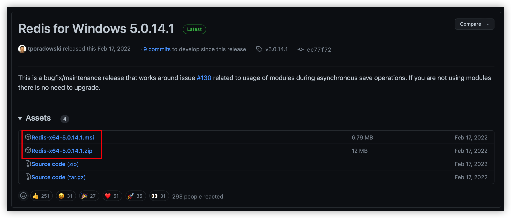

개발 머신이 윈도우인 경우 테스트를 위해서 윈도우에 redis를 설치해야 할 경우가 있습니다. [Redis](https://redis.io)는 오픈 소스 프로젝트로 윈도우용 설치 파일을 [Microsoft Open Tech](https://github.com/microsoftarchive/redis)에서 배포하고 있습니다. 하지만 가장 최근 버전이 2016년 7월 1일에 배포된 `3.0.504`이고 더 이상 업데이트되고 있지 않습니다.

[Redis 공식 사이트](https://redis.io/docs/getting-started/installation/install-redis-on-windows/)에서는 WSL(Windows Subsystem for Linux)을 사용해서 redis를 설치하라고 합니다. 이건 좀 번거롭기도 하고 리눅스가 익숙하지 않다면 설치가 꺼려지는데 다행히 Tomasz Poradowski라는 분이 설치용 바이너리를 계속해서 배포해 주고 있습니다.

https://github.com/tporadowski/redis

위 링크를 클릭한 후 아래 그림처럼 우측에 있는 release 버전을 클릭합니다.

msi 설치 파일과 zip 파일(포터블 버전) 중 선택해서 다운로드한 후 설치하면 됩니다.

