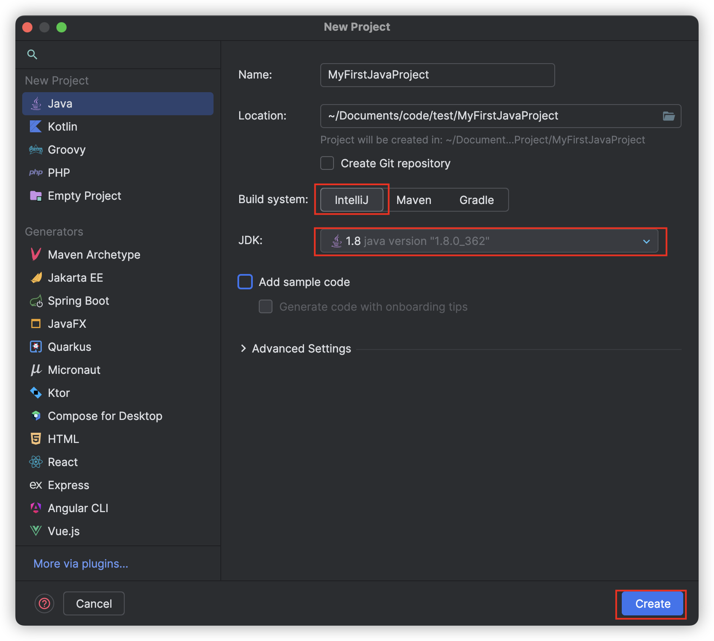
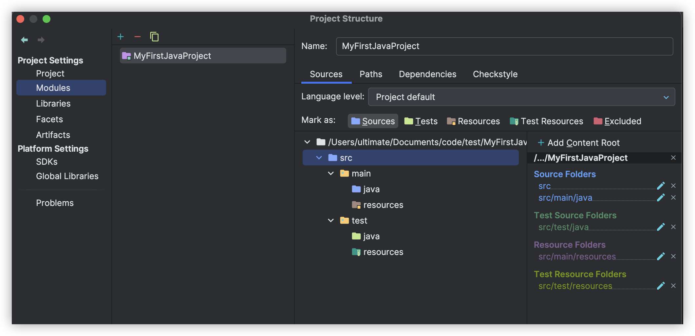

IntelliJ IDEA에서 Java 프로젝트를 구성할 때, 소스 디렉토리(Sources), 테스트 디렉토리(Tests), 리소스 디렉토리(Resources), 테스트 리소스 디렉토리(Test Resources), 그리고 제외할 디렉토리(Excluded)를 적절하게 지정하는 것은 프로젝트를 효율적으로 관리하는 데 매우 중요합니다. 이 글에서는 IntelliJ 기본 빌드 시스템을 사용하여 이러한 디렉토리들을 어떻게 설정하고 사용하는지에 대해 단계별로 설명하겠습니다.

---

## **IntelliJ IDEA에서 Java 프로젝트 디렉토리 설정하기**

### **1. IntelliJ IDEA에서 프로젝트 생성**

먼저 IntelliJ IDEA에서 새 Java 프로젝트를 생성해야 합니다.

1. **IntelliJ IDEA 실행**: IntelliJ를 열고, `New Project`를 클릭하여 새 프로젝트를 생성합니다.
2. **Java 프로젝트 선택**: Java를 선택하고, 프로젝트 이름과 위치, JDK를 지정한 후 `Create`를 클릭하여 프로젝트를 생성합니다.
Build system은 default인 **IntelliJ**를 지정했습니다. 



프로젝트가 생성되면 기본적인 디렉토리 구조가 만들어집니다. 이제 이 구조를 IntelliJ에서 적절히 설정해 보겠습니다.

### **2. 소스 디렉토리(Sources) 설정**

소스 디렉토리는 Java 코드 파일(.java)이 위치하는 디렉토리입니다. 기본적으로 `src/main/java`가 소스 디렉토리로 설정됩니다.

1. **디렉토리 선택**: 프로젝트 창에서 `src/main/java` 디렉토리를 우클릭합니다.
2. **디렉토리 지정**: `Mark Directory as -> Sources Root`를 선택합니다.

IntelliJ는 이 디렉토리를 소스 코드의 루트로 인식하게 되며, 이곳에 있는 모든 Java 파일을 컴파일 대상으로 간주합니다.

### **3. 테스트 디렉토리(Tests) 설정**

테스트 디렉토리는 JUnit 등 테스트 코드가 위치하는 디렉토리입니다. 기본적으로 `src/test/java`가 테스트 디렉토리로 설정됩니다.

1. **디렉토리 선택**: 프로젝트 창에서 `src/test/java` 디렉토리를 우클릭합니다.
2. **디렉토리 지정**: `Mark Directory as -> Test Sources Root`를 선택합니다.

이 디렉토리는 테스트 코드의 루트로 인식되며, 이곳에 있는 모든 Java 파일은 테스트 코드로 처리됩니다. 이 설정을 통해, IntelliJ는 이 디렉토리에 위치한 코드만을 테스트 목적으로 빌드하고 실행하게 됩니다.

### **4. 리소스 디렉토리(Resources) 설정**

리소스 디렉토리는 애플리케이션에서 사용되는 설정 파일, 이미지, XML 파일 등의 리소스를 저장하는 곳입니다. 기본적으로 `src/main/resources`가 리소스 디렉토리로 설정됩니다.

1. **디렉토리 선택**: 프로젝트 창에서 `src/main/resources` 디렉토리를 우클릭합니다.
2. **디렉토리 지정**: `Mark Directory as -> Resources Root`를 선택합니다.

이 디렉토리에 있는 파일들은 빌드 과정에서 애플리케이션의 클래스패스에 포함되어 런타임에 사용됩니다.

### **5. 테스트 리소스 디렉토리(Test Resources) 설정**

테스트 리소스 디렉토리는 테스트 코드에서 사용하는 리소스를 저장하는 곳입니다. 일반적으로 `src/test/resources` 디렉토리가 사용됩니다.

1. **디렉토리 선택**: 프로젝트 창에서 `src/test/resources` 디렉토리를 우클릭합니다.
2. **디렉토리 지정**: `Mark Directory as -> Test Resources Root`를 선택합니다.

이 설정을 통해, 이 디렉토리에 있는 리소스 파일들은 테스트 실행 시 클래스패스에 포함되어 테스트 코드에서 사용할 수 있습니다.

### **6. 제외 디렉토리(Excluded) 설정**

프로젝트에서 빌드 또는 테스트에 포함하지 않도록 제외할 디렉토리(예: 빌드 결과물, 로그 파일 등)를 설정할 수 있습니다.

1. **디렉토리 선택**: 제외하려는 디렉토리(예: `out` 또는 `build` 디렉토리)를 우클릭합니다.
2. **디렉토리 지정**: `Mark Directory as -> Excluded`를 선택합니다.

이 설정을 통해 IntelliJ는 이 디렉토리를 빌드나 검색 경로에 포함시키지 않으며, 불필요한 파일이 빌드 과정에 영향을 주지 않도록 합니다.



프로젝트 설정에서 위와 같이 지정해도 됩니다.

### **7. 설정이 완료된 디렉토리 구조**

이제 IntelliJ에서 각 디렉토리가 적절히 설정된 프로젝트 구조는 다음과 같아야 합니다:

```
MyFirstJavaProject/
├── src/
│   ├── main/
│   │   ├── java/               (Sources Root)
│   │   └── resources/          (Resources Root)
│   └── test/
│       ├── java/               (Test Sources Root)
│       └── resources/          (Test Resources Root)
└── out/                        (Excluded)
```

### **8. 예제 코드 작성 및 테스트**

이제 적절히 설정된 디렉토리 구조를 기반으로 간단한 샘플 코드와 테스트 코드를 작성해 보겠습니다.

1. **소스 코드 작성**:
   `src/main/java/com/example/Main.java`
   ```java
   package com.example;

   public class Main {
       public static void main(String[] args) {
           System.out.println("Hello, IntelliJ IDEA!");
       }

       public int add(int a, int b) {
           return a + b;
       }
   }
   ```

2. **테스트 코드 작성**:
   `src/test/java/com/example/MainTest.java`
   ```java
   package com.example;

   import org.junit.jupiter.api.Test;
   import static org.junit.jupiter.api.Assertions.assertEquals;

   public class MainTest {

       @Test
       public void testAdd() {
           Main main = new Main();
           int result = main.add(2, 3);
           assertEquals(5, result);
       }
   }
   ```

### **9. 마무리**

이제 IntelliJ IDEA에서 기본 빌드 시스템을 사용하여 Java 프로젝트를 구성하고, 소스 디렉토리, 테스트 디렉토리, 리소스 디렉토리 등을 설정하는 방법을 익혔습니다. 이러한 디렉토리 설정은 프로젝트 관리의 기본이며, 코드 작성, 테스트, 빌드 과정에서 큰 도움이 됩니다.

이 블로그 글이 IntelliJ IDEA에서 프로젝트를 설정하는 데 유용한 가이드가 되었기를 바랍니다. 이제 직접 IntelliJ를 사용하여 다양한 Java 프로젝트를 생성하고, 효율적으로 관리해 보세요.

--- 

이 블로그 글을 통해 IntelliJ IDEA에서 Java 프로젝트의 디렉토리 구조를 어떻게 설정하고 관리할 수 있는지 이해하셨기를 바랍니다. 디렉토리를 올바르게 설정하면 프로젝트가 더욱 체계적으로 관리되며, 개발 속도와 품질이 향상될 것입니다.
