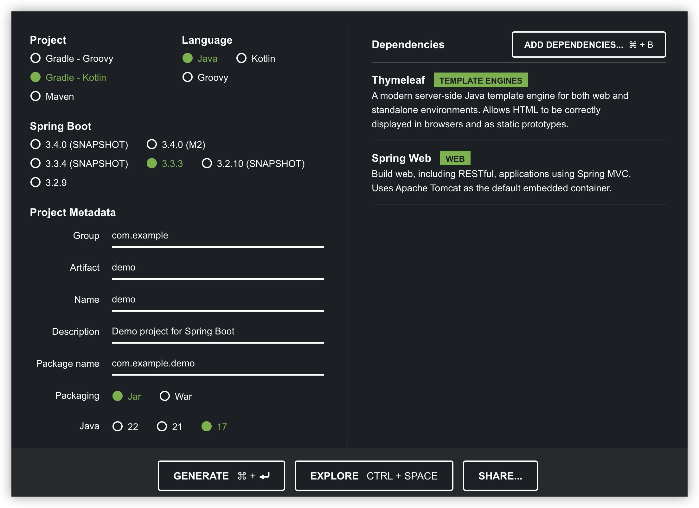

# Spring Boot와 Thymeleaf를 사용한 첫 번째 웹 애플리케이션 만들기

Spring Boot는 Java로 간단하고 신속하게 웹 애플리케이션을 개발할 수 있게 도와주는 프레임워크입니다. Thymeleaf는 서버사이드 템플릿 엔진으로, Spring MVC와 통합하여 HTML을 동적으로 생성하는 데 사용됩니다. 이 튜토리얼에서는 Spring Boot와 Thymeleaf를 사용하여 간단한 웹 애플리케이션을 만드는 방법을 단계별로 설명합니다.

### 1. 프로젝트 설정

#### 1.1 Spring Initializr 사용
Spring Boot 프로젝트를 시작하는 가장 쉬운 방법은 [Spring Initializr](https://start.spring.io/)를 사용하는 것입니다.



1. [Spring Initializr](https://start.spring.io/) 웹사이트에 접속합니다.
2. 다음과 같이 프로젝트 설정을 합니다:
   - **Project**: Gradle Project 또는 Maven Project (선호하는 빌드 도구 선택)
   - **Language**: Java
   - **Spring Boot**: 최신 버전 선택 (예: 3.0.0)
   - **Project Metadata**:
     - **Group**: `com.example`
     - **Artifact**: `springboot-thymeleaf-demo`
     - **Name**: `springboot-thymeleaf-demo`
     - **Package Name**: `com.example.springbootthymeleafdemo`
   - **Dependencies**:
     - Spring Web
     - Thymeleaf

3. "Generate" 버튼을 눌러 프로젝트를 생성하고, 다운로드된 압축 파일을 해제합니다.

#### 1.2 IDE에서 프로젝트 열기
선호하는 IDE(Eclipse, IntelliJ IDEA 등)에서 생성된 프로젝트를 엽니다.

### 2. Spring Boot 애플리케이션 개발

#### 2.1 기본 구조 설명
프로젝트가 생성되면 기본적인 디렉토리 구조는 다음과 같습니다:

```
springboot-thymeleaf-demo/
├── src/
│   ├── main/
│   │   ├── java/
│   │   │   └── com/example/springbootthymeleafdemo/
│   │   │       └── SpringbootThymeleafDemoApplication.java
│   │   └── resources/
│   │       ├── static/   // 정적 자원 (CSS, JS 등)
│   │       ├── templates/ // Thymeleaf 템플릿 파일
│   │       └── application.properties
└── build.gradle (또는 pom.xml)
```

#### 2.2 메인 애플리케이션 클래스 작성

`SpringbootThymeleafDemoApplication.java`는 애플리케이션의 진입점입니다. 이 파일은 Spring Boot 애플리케이션을 시작하는 역할을 합니다. 기본적으로, 이 파일은 다음과 같은 코드로 구성됩니다:

```java
package com.example.springbootthymeleafdemo;

import org.springframework.boot.SpringApplication;
import org.springframework.boot.autoconfigure.SpringBootApplication;

@SpringBootApplication
public class SpringbootThymeleafDemoApplication {

    public static void main(String[] args) {
        SpringApplication.run(SpringbootThymeleafDemoApplication.class, args);
    }

}
```

#### 2.3 컨트롤러 작성

컨트롤러는 사용자의 요청을 처리하고, 데이터를 모델에 담아 뷰에 전달하는 역할을 합니다. 간단한 컨트롤러를 작성해보겠습니다.

`HomeController.java` 파일을 `com.example.springbootthymeleafdemo` 패키지에 생성합니다:

```java
package com.example.springbootthymeleafdemo;

import org.springframework.stereotype.Controller;
import org.springframework.ui.Model;
import org.springframework.web.bind.annotation.GetMapping;

@Controller
public class HomeController {

    @GetMapping("/")
    public String home(Model model) {
        model.addAttribute("message", "Hello, Thymeleaf!");
        return "index";
    }
}
```

- `@Controller`: 이 클래스가 Spring MVC 컨트롤러임을 나타냅니다.
- `@GetMapping("/")`: 루트 경로(`/`)에 대한 GET 요청을 처리합니다.
- `Model`: 뷰에 데이터를 전달하기 위해 사용됩니다.
- `index`: 반환된 문자열은 Thymeleaf 템플릿 파일(`index.html`)의 이름입니다.

#### 2.4 Thymeleaf 템플릿 작성

`src/main/resources/templates/` 디렉토리에 `index.html` 파일을 생성합니다:

```html
<!DOCTYPE html>
<html xmlns:th="http://www.thymeleaf.org">
<head>
    <title>Spring Boot + Thymeleaf</title>
</head>
<body>
    <h1>Welcome to Spring Boot with Thymeleaf!</h1>
    <p th:text="'Message from Controller: ' + ${message}"></p>
</body>
</html>
```

- `th:text`: Thymeleaf의 속성 중 하나로, 모델 데이터를 HTML 요소에 출력합니다.

#### 2.5 애플리케이션 실행

모든 설정이 완료되었으므로 이제 애플리케이션을 실행할 수 있습니다.

IDE에서 `SpringbootThymeleafDemoApplication.java` 파일을 실행하거나, 터미널에서 프로젝트의 루트 디렉토리로 이동한 후 다음 명령어를 실행합니다:

```bash
./gradlew bootRun
```
또는

```bash
./mvnw spring-boot:run
```

브라우저에서 `http://localhost:8080`에 접속하면 "Hello, Thymeleaf!" 메시지가 포함된 간단한 웹 페이지를 볼 수 있습니다.


### 3. 결론

이 글에서는 Spring Boot와 Thymeleaf를 사용하여 간단한 웹 애플리케이션을 만드는 방법을 배웠습니다. 이 예제는 Spring Boot의 기본적인 사용법을 익히고, Thymeleaf 템플릿 엔진을 사용하여 동적인 HTML 페이지를 생성하는 방법을 이해하는 데 도움이 되리라 믿습니다.
